## 𝔸𝕓𝕠𝕦𝕥 𝕞𝕖
```csharp
public sealed class Me
{
    // Basic info
    public string Name => "Alex";
    public string Location => "Minsk, Belarus";
    public string WhoIAm => "Full stack developer";

    // More info
    public string InfoAboutMe => """
        I am a full stack developer from Minsk. I'm passionate about automation and creating 
        small utilities that enhance my user experience.
        """;
}
```

## 𝕄𝕪 𝕤𝕜𝕚𝕝𝕝𝕤


## 𝕄𝕪 𝕤𝕥𝕒𝕥𝕤:
<div align="center">
  
  
  
</div>
<div align="center">
  
</div>  
 <br/> 

